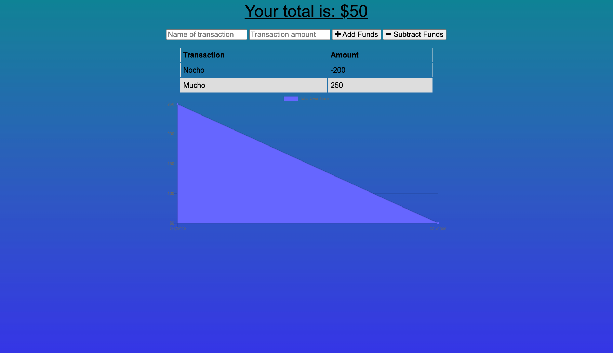

# Budget-Tracker-PWA

## Description 
This project allows users to add expenses and deposits to their budget with or without a connection. If the user enters transactions offline, the changes will be reflected when they're brought back online. Technology used are IndexDB, Web Manifest, and Service Workers for offline functionality. 

## Usage 
This project will allow users to create new transactions online or offline. 
Checkout deployed application on [Heroku](https://gentle-anchorage-10028.herokuapp.com/) 

## Contributing 
Contributors should read the installation section. 

## Tests
There are no tests for this project. 

## License 
This project is license under MIT

## Questions
If you have any questions about this projects, please contact me directly at dumasdj23@gmail.com. You can view more of my projects at https://github.com/onlydeniros.